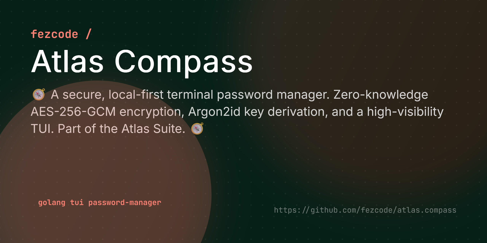

# Atlas Compass



> [!CAUTION]
> **WARNING: UNRECOVERABLE MASTER PASSWORD**
> `atlas.compass` uses zero-knowledge encryption. Your Master Password is the **only** key to your vault. If you lose it, your data is **mathematically impossible** to recover. There are no "Reset Password" links, no cloud backdoors, and no recovery services. **Write it down and keep it somewhere safe.**

**atlas.compass** is a secure, local-first password manager for the terminal. Part of the **Atlas Suite**, it adheres to the "your keys, your control" philosophy with strong encryption and a clean, high-visibility TUI.


## ✨ Features

- 🔒 **Strong Encryption:** AES-256-GCM encryption with Argon2id key derivation.
- 💾 **Local First:** Your vault lives in `~/.atlas/compass.enc`—no cloud, no sync, full control.
- ⌨️ **Keyboard Centric:** Navigate your secrets with Vim-style keys (`j`, `k`, `/`).
- 📋 **Secure Clipboard:** Copy passwords/usernames with auto-clear protection.
- 🔍 **Fuzzy Search:** Instantly find credentials by title, username, or URL.
- 🎨 **High Visibility:** Modern, high-contrast UI designed for readability in any terminal.
- 📦 **Cross-Platform:** Binaries for Windows, Linux, and macOS.

## 🚀 Installation

### From Source
```bash
git clone https://github.com/fezcode/atlas.compass
cd atlas.compass
gobake build
```

## ⌨️ Usage

Run the binary to unlock your vault (or create a new one):

```bash
./build/atlas.compass-windows-amd64.exe # example for windows
```

### First Run
If no vault exists, the password you enter at the prompt will become your **Master Password**. Do not forget it; there is no recovery mechanism.

## 🔐 Changing Master Password

You can rotate your Master Password directly from the vault:
1. Press `P` in the list view.
2. Type `YES` to confirm you want to proceed.
3. Enter your **Current** password.
4. Enter and confirm your **New** password.

This process will decrypt your entire vault and **atomically re-encrypt** it with the new key, ensuring no data loss occurs even if the process is interrupted.

## 📂 Storage Location

Your encrypted vault is stored locally in your user's home directory:

- **Windows:** `%USERPROFILE%\.atlas\compass.enc`
- **Linux/macOS:** `~/.atlas/compass.enc`

This directory is created automatically on the first run. To backup your passwords, simply copy the `compass.enc` file to a secure location. **Note:** If you delete this file, all your data will be permanently lost.

## 🕹️ Controls

| Key | Context | Action |
|-----|---------|--------|
| `Enter` | Auth | Unlock Vault |
| `q` | List | Quit |
| `↑/↓` or `k/j` | List | Navigate entries |
| `/` | List | Search/Filter entries |
| `a` | List | Add new entry |
| `Enter` | List | View entry details |
| `e` | List/Detail | Edit entry |
| `c` | List/Detail | Copy Password to clipboard |
| `u` | List/Detail | Copy Username to clipboard |
| `d` | List | Delete entry |
| `P` | List | **Change Master Password** |
| `Esc` | Detail/Editor | Back to List / Cancel |
| `Tab` | Editor | Next field |
| `Shift+Tab` | Editor | Previous field |
| `Enter` | Editor | Save (on last field) |

## 🏗️ Architecture

- **TUI:** Built with `bubbletea` and `lipgloss`.
- **Crypto:** Standard `crypto/aes` and `golang.org/x/crypto/argon2`.
- **Storage:** JSON blob encrypted with AES-GCM and Argon2id.

## 📄 License
MIT License - see [LICENSE](LICENSE) for details.